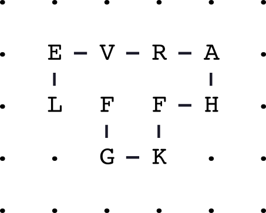

=================================
Latticeproteins
=================================

.. image:: https://readthedocs.org/projects/latticeproteins/badge/?version=latest
    :target: http://latticeproteins.readthedocs.io/en/latest/?badge=latest
    :alt: Documentation Status

``latticeproteins`` is a 2d protein lattice simulator. It enumerates all possible
conformations for an L-length chain of amino acids on a two-dimensional grid (no
crossing). Many thermodynamic properties can be calculated from energy landscape
constructed from the full ensemble of conformations.

Install
-------
Currently, install this package from source. Clone this repository and change
directories into the package. Install a development version:

.. code::

    pip install -e .

Credit
------

This is a fork of the ``latticeprotein`` simulator written by `Jesse Bloom`_. There
are some pretty significant differences between the two packages. All credit goes
to Jesse for the original implementation, so please cite Jesse's papers if you use this software:

    * `Protein stability promotes evolvability`_

    * `Stability and the evolvability of function in a model protein`_

This maintains the `GNU Public License`_ of the original package.

Dependencies
------------

+ ``numpy``
+ ``svgwrite``

The program uses a C extension, and so compilation requires the ``gcc`` compiler. To install the package from source::

Documentation
-------------

See the `Documentation`_ for this package.

.. _`Jesse Bloom`: http://research.fhcrc.org/bloom/en.html
.. _`Protein stability promotes evolvability`: http://www.ncbi.nlm.nih.gov/pubmed/16581913
.. _`Stability and the evolvability of function in a model protein`: http://www.ncbi.nlm.nih.gov/pubmed/15111394
.. _`GNU Public License`: http://www.gnu.org/licenses/gpl.html
.. _`Documentation`: http://latticeproteins.readthedocs.io
