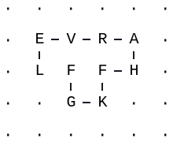
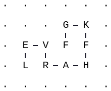

Tutorials
=========

A few things before you start
-----------------------------
There are a few things you need to know before you get started. Due to the
poor scaling of lattice protein calculations, the ``latticeproteins`` package takes
a few precautions. First, folding a sequence is done in separate steps (and functions) rather than
through a single call. This forces you to be aware of the magnitude of each call.
You'll notice in these tutorials, we have to import many functions.

Second, the hardest step (most memory and time) in the calculation, by far, is enumerating conformations on
the grid. ``latticeproteins`` tries to reduce the pain by creating a
database of conformations in pickle files after the first creation. If you delete this directory,
it will have to recreate it next time you run calculations.

A basic example of a lattice protein
------------------------------------

Import the latticeproteins package.

Input:

.. code:: python

    import latticeproteins

The ``LatticeThermodyanmics`` class creates objects that can calculate
lattice protein thermodynamics for any sequences of a specified length.
In the example below, we initialize this object for sequences of length
10. Note that to avoid repeating expensive conformation enumerations,
the ``LatticeThermodynamics`` object creates a directory in your current
location called ``database``. Inside this directory, it stores python
``pickle`` files that include a database of all conformations on a 2d
grid.

Input:

.. code:: python

    seq_length = 10
    temperature = 1.0
    lattice = latticeproteins.LatticeThermodynamics.from_length(seq_length, 1.0)

Now, we'll create a random sequence with the given length and start
evaluating thermodynamic values.

Input:

.. code:: python

    seq = latticeproteins.random_sequence(seq_length)
    print(seq)

Output:

.. parsed-literal::

    ['L', 'E', 'V', 'R', 'A', 'H', 'F', 'K', 'G', 'F']

Input:

.. code:: python

    print("Energy of native conformation: %f" % lattice.nativeE(seq))
    print("stability of native conformation: %f" % lattice.stability(seq))
    print("fraction folded: %f" % lattice.fracfolded(seq))

Output:

.. parsed-literal::

    Energy of native conformation: -22.400000
    stability of native conformation: 0.608617
    fraction folded: 0.352375

The lattice protein package comes with a drawing module that creates SVG
drawing of the lattice conformations.

Input:

.. code:: python

    conf = lattice.native_conf(seq)
    latticeproteins.draw.in_notebook(seq, conf)

Output:

Fold lattice protein to nonnative state
---------------------------------------

The ``LatticeThermodynamics`` object can also do the above calculations
while using a specified *target* native state.

Input:

.. code:: python

    # Find the 5 lowest energy conformations.
    alt_conf = lattice.k_lowest_confs(seq, 5)

    # Choose the 5th lowest as the target fold.
    target = alt_conf[-1]
    latticeproteins.draw.in_notebook(seq, target)

Output:

Input:

.. code:: python

    print("Energy of native conformation: %f" % lattice.nativeE(seq, target=target))
    print("stability of native conformation: %f" % lattice.stability(seq, target=target))
    print("fraction folded: %f" % lattice.fracfolded(seq, target=target))

Output:

.. parsed-literal::

    Energy of native conformation: -20.110000
    stability of native conformation: 3.296724
    fraction folded: 0.035684
